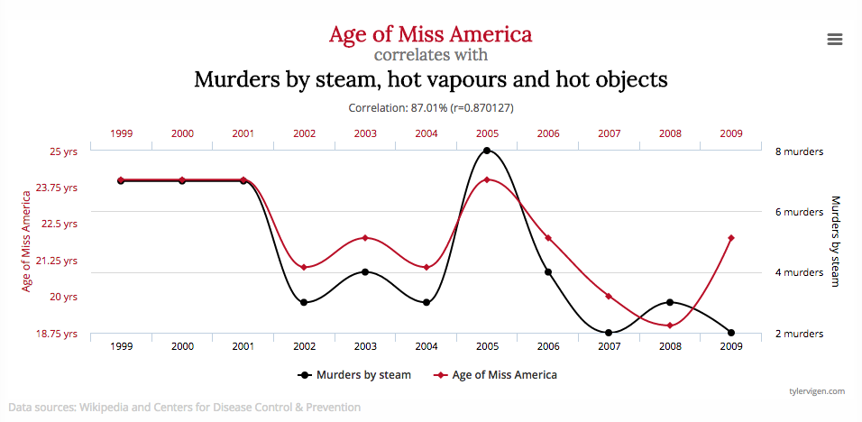

# Operációs rendszerek VIMIAB00
# AMP labor
# Jegyzőkönyv
A labor során elvégzendő feladatok kódját ebbe a repositoryba, a feljegyzéseket ebbe a fileba kell feltölteni. Beadás előtt a vonal feletti részeket ki kell törölni. 

A dokumentációhoz képernyőképet hozzáadni a következőképpen lehet (a repositoryban kell lennie a képnek, relatív útvonnallal hivatkozva):

A dokumentáció nyelve elsősorban angol, de akinek ez gondot okoz írhatja magyarul illetve németül (németes csoport) is. A dokumentációs skeleton angol nyelven írodott, de adaptálni lehet más nyelvre amennyiben szükséges.

A git használatához a következő parancsokat szükséges ismerni:
* `git clone <repository url>` leklónolja a githubon lévő repositoryt egy lokális másolatba
* `git add <file>` a következő commithoz hozzáadja a file-t
* `git commit -m "<message>"` létrehoz egy \<message\> nevű commit-ot
* `git push origin master` a lokális változtatásokat felmásolja a szerverre
* `git pull origin master` a szerveren lévő új változásokat lemásolja a lokális repositoryba

---

# Documentation for the AMP Laboratory

## Toolchains

**Did both of the toolchains work? Was this expected? Why?**

Answer

## Image Preparation

**What is the name of the real-time kernel? What release and version is it?**

Answer

**What devices are present in the booted system as part of the device tree?**

Answer

**Which parameter has to be set to only allow 3 CPUs in the system?**

Answer

**Which parameter can be used to limit the RAM usage of the system to 512M?**

Answer

**What do the existing parameters mean in the boot.cmdfile?**

Answer

## GPIO

**At which bus address does the I/O block start?**

Answer

**Where can we reach it from software running withoutan OS?**

Answer

**Where can we reach it from software running on top of an OS running in kernel mode?**

Answer

**Which register (name and busaddress) is responsible for selecting the GPIO function of pins #14, #15 and #16? Which bits?**

Answer

**Which registers are the corresponding SET, CLEAR and LEVEL registers (name and busaddress)?**

Answer

### Task 1

Code path: \<path\>

Short specification of the program

Design decisions if necessary 

Summary of the development

### Task 7

Code path: \<path\>

Short specification of the program

Design decisions if necessary 

Summary of the development

## Kernel Modules

**How long was the time difference between two ‘printk’ statements?**

Answer

### Task 2

Code path: \<path\>

Short specification of the program

Design decisions if necessary 

Summary of the development

### Task 8

Code path: \<path\>

Short specification of the program

Design decisions if necessary 

Summary of the development

## Latency Measurements

**How long is one cycleof the fpga in (nano)seconds?**

Answer

### Results

_It is not necessary to include a graph at each step of every measurement. Include only those where the values are either unexpected, or there is a certain explanation for what we are seeing!_

**Normal kernel, no stress**

* min:
* max:
* avg:

Graph:

**Normal kernel, with stress**

* min:
* max:
* avg:

Graph:

**Normal kernel, with stress and low priority**

* min:
* max:
* avg:

Graph:

**Normal kernel, with stress and high priority**

* min:
* max:
* avg:

Graph:

**Normal kernel, with stress running in a kernel module**

* min:
* max:
* avg:

Graph:

**RT kernel, with stress and low RT priority**

* min:
* max:
* avg:

Graph:

**RT kernel, with stress and high RT priority**

* min:
* max:
* avg:

Graph:

**RT kernel, with low RT stress and high RT priority**

* min:
* max:
* avg:

Graph:

**RT kernel, with high RT stress and low RT priority**

* min:
* max:
* avg:

Graph:

**AMP system, no stress**

* min:
* max:
* avg:

Graph:

**AMP system, with high RT stress**

* min:
* max:
* avg:

Graph:

---

# Mini-OHV
Ez már nem része az értékelendő munkának.

## Miben lehetne jobb a labor?

Válasz néhány szóban

## Mi tetszett a laborban?

Válasz néhány szóban

## Mi nem tetszett a laborban?

Válasz néhány szóban

## Mennyire érzed hasznosnak a labor anyagát?

Válasz néhány szóban